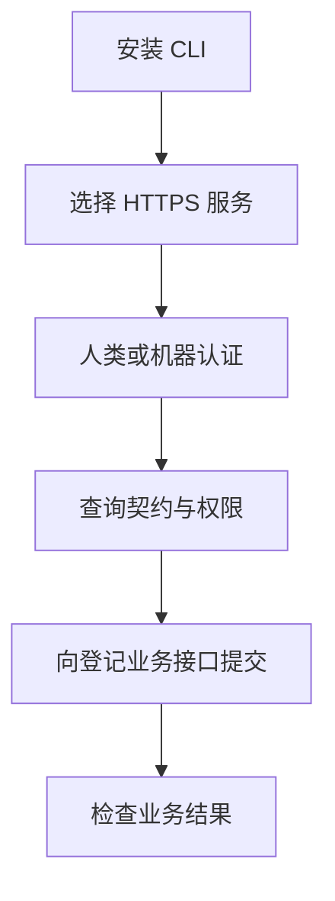

# 独立 CLI 交付

复用现有业务能力与授权后的 CLI brief。仅提取 HTTP 客户端、环境读取和无秘密接口目录；建立全新 Git 历史。

不涉及 OneID 匹配或客户主键写入。持久化仅为本地非秘密配置和系统密钥环；所有业务写入由服务端处理。参考 GitHub CLI 独立分发、Go 模块安装与 Cobra 命令组织：https://cli.github.com/manual/gh_repo_create 和 https://github.com/spf13/cobra。

交付要求：独立构建及原有客户端合同测试、五个平台构建、全新历史、公开访问和 Release 下载校验。没有真实 Provider 写验收。

构建验证：客户端 16 项测试通过，无 skip；Darwin/Linux amd64、arm64 及 Windows amd64 均构建成功。真实已授权人类会话认证读取成功；不执行外部业务写入。
